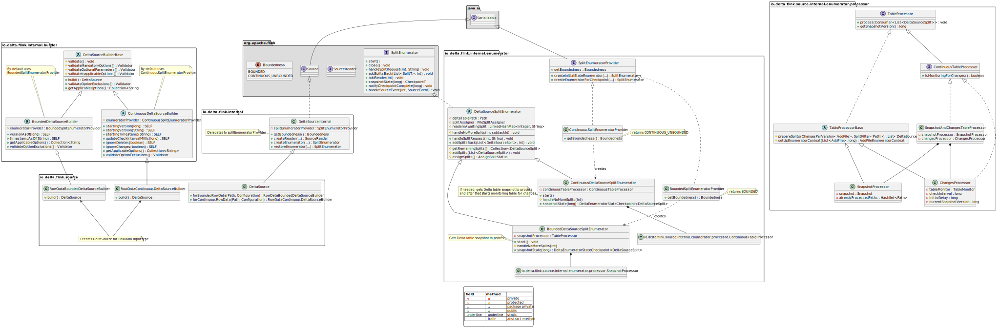
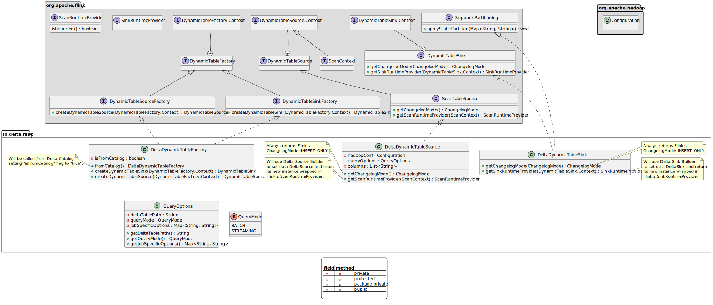
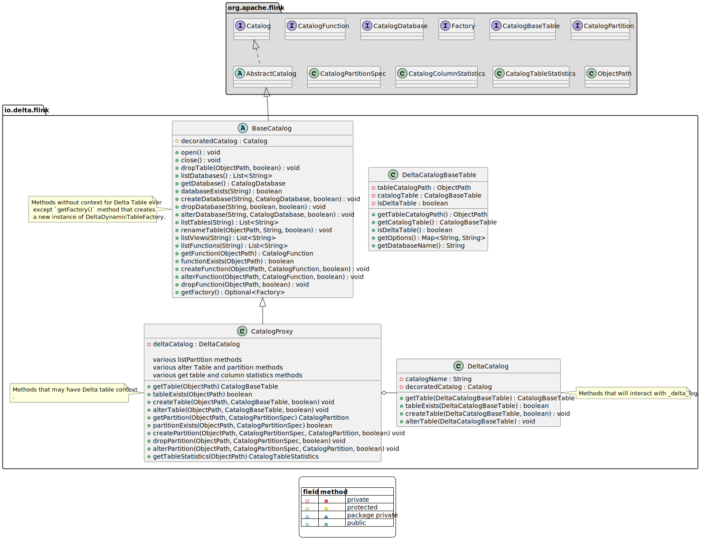
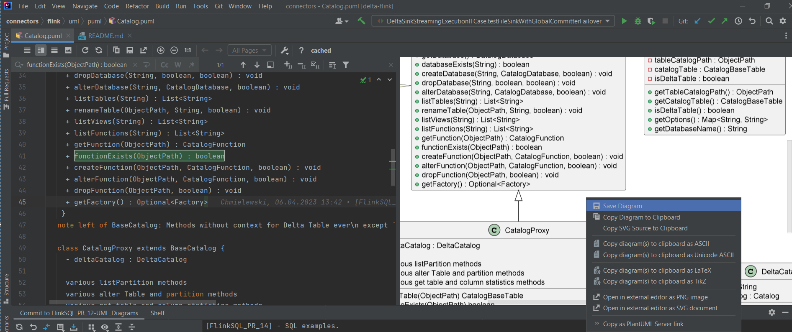
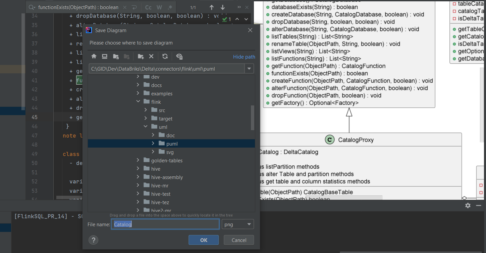

# UML Diagrams
### DeltaSource UML diagram

### DeltaSink UML diagram

### TableFactory UML diagram

### Catalog UML diagram:

# PlantUML
The UML diagrams were created using [PlantUML](https://plantuml.com/) tool following PlantUML's
[class diagram](https://plantuml.com/class-diagram) syntax.

The source files for PlantUML diagrams are located [here.](puml)

## Updating and generating new diagrams
### The `puml` Files
To update existing UML diagram simply open existing `puml` file in any text editor and
apply changes following [PlantUML syntax](https://plantuml.com/class-diagram).
If you wish to create a new diagram simply open new text file in any editor you want,
"code" the diagram using [PlantUML syntax](https://plantuml.com/class-diagram) and save the file with `.plum` extension.

### Generating diagram image
The SVG files attached to this document were generated using IntelliJ [PlantUML plugin](https://plugins.jetbrains.com/plugin/7017-plantuml-integration)
and [Graphiz](https://graphviz.org) library. Use IntelliJ plugin manager to install PlantUML plugin
and for Graphiz library follow the [installation instructions](https://graphviz.org/download/)
suited for your operating system. Other IDEs like for example Eclipse also have [support for PlantUML](https://plantuml.com/eclipse).
The following instructions will be based on IntelliJ IDE.

The PlantUML plugin allows to see a live view of the diagram while it is being edited.  
To save diagram as an image:
+ Open `.puml` file in IntelliJ. Give few seconds for PlantUML plugin to render the live view.
+ Right-click on the diagram's live view, select "Save Diagram" from the menu.

+ The new window will pop up. Type file name you wish to use for the new image and select image type (SVG, PNG etc.).

The SGV type is well suited for markdown files since it will automatically adjust its size
to the web browser window. This is handy for big diagrams.
