# Delta Lake Tutorial: Spark + AI Summit 2019 EU

### Sign Up for Databricks Community Edition

Expand to view more details about Databricks Community Edition

&nbsp; &nbsp;
Start by signing up for **Databricks Community Edition** by going to [databricks.com/try](https://databricks.com/try) and choose *Community Edition*.  

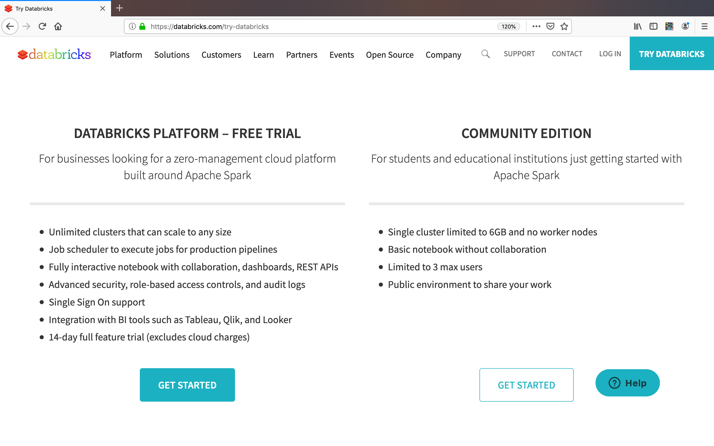

Note, the **Community Edition** link is on the right side with the *white* **Get Started** button (i.e. *not* the green button).   This is a free edition of Databricks and does not require your credit card.  

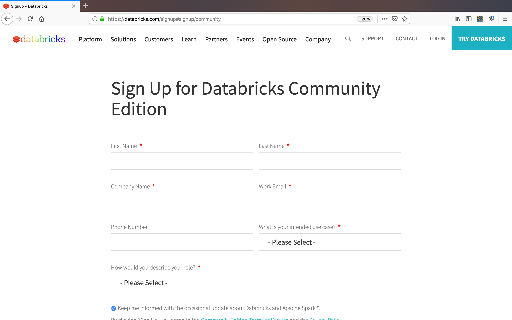

Next, sign up for **Databricks Community Edition (DBCE)** by filling out the form (note, no credit card is required).  Once you sign up, verify your account by going to your email account that you filled out in the preceding form.  Once your account is validated, go to DBCE which should look similar to below.

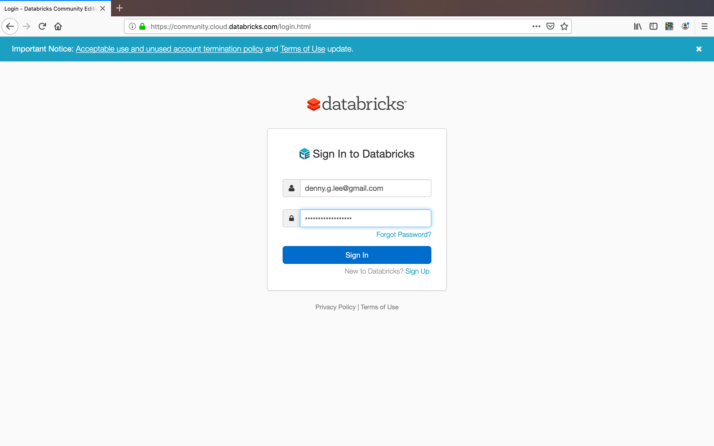

Once you log in, you will view the Databricks workspace similar to the screenshot below.

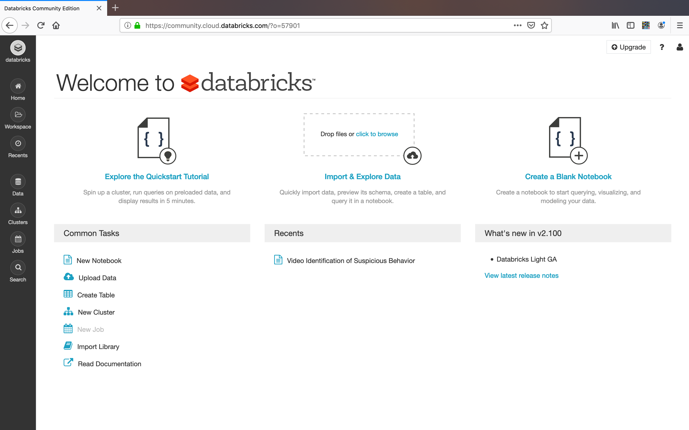

### Create a Cluster with Databricks Runtime 6.1+

Expand to view more details about Creating a Cluster

&nbsp; &nbsp;
Start by clicking the *Create Cluster* on the left pane.

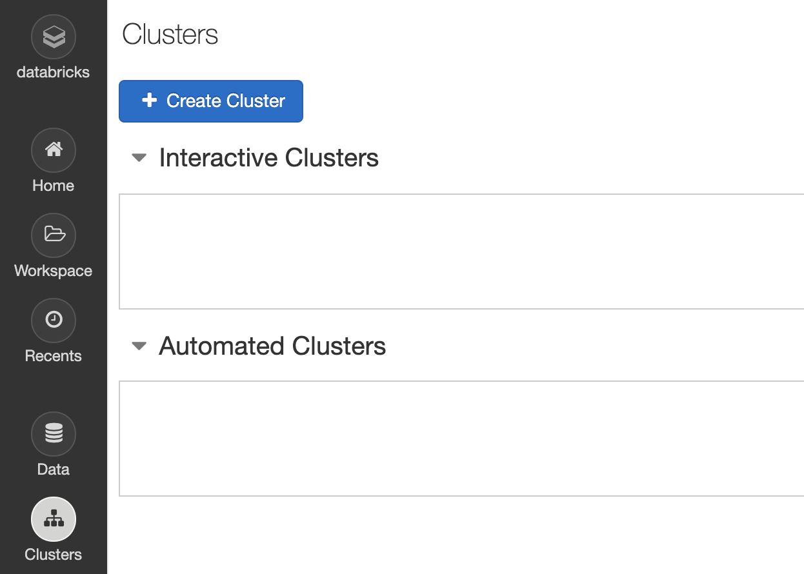

This will bring up the *Create Cluster* dialog as noted in the following screenshot.

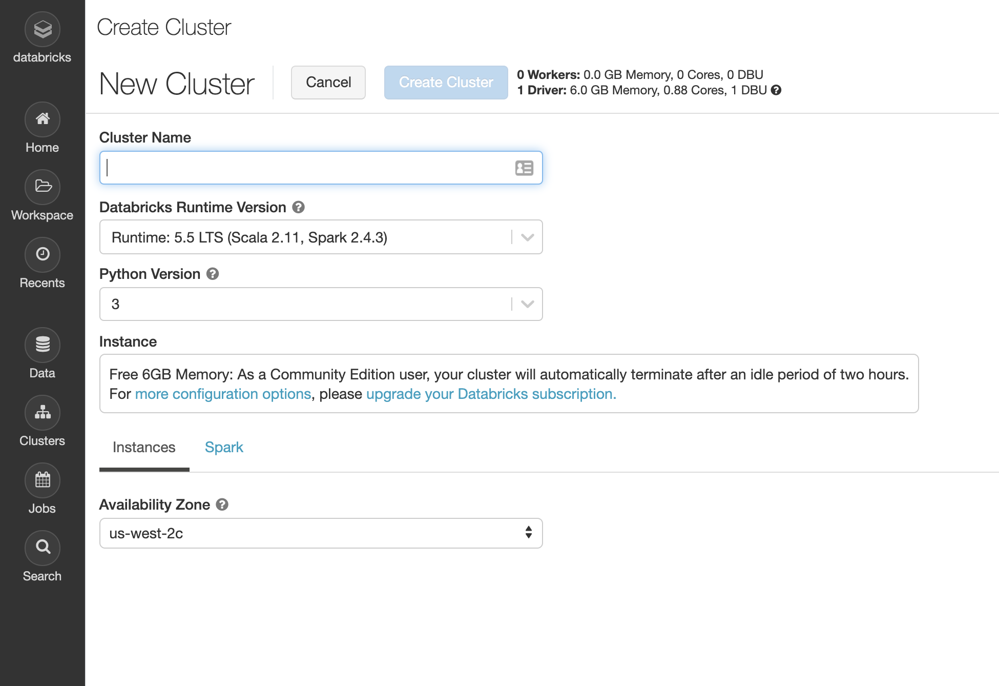

Fill in the **name** of your cluster as well as the *Databricks Runtime Version* - choose the **6.1 Beta** runtime.

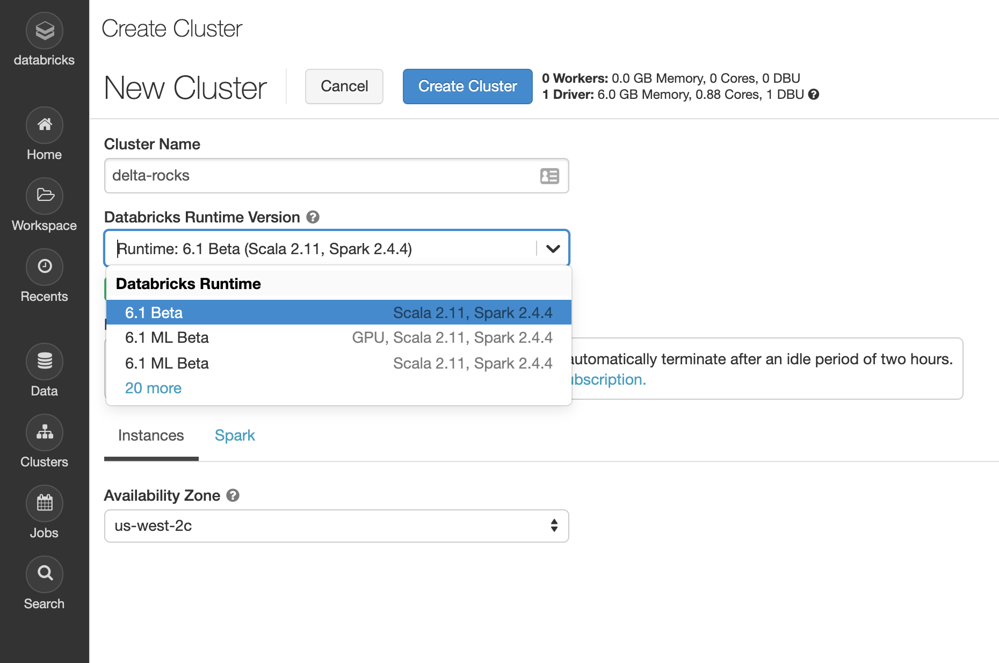 

Click on **Create Cluster** and then your cluster will be up and running.

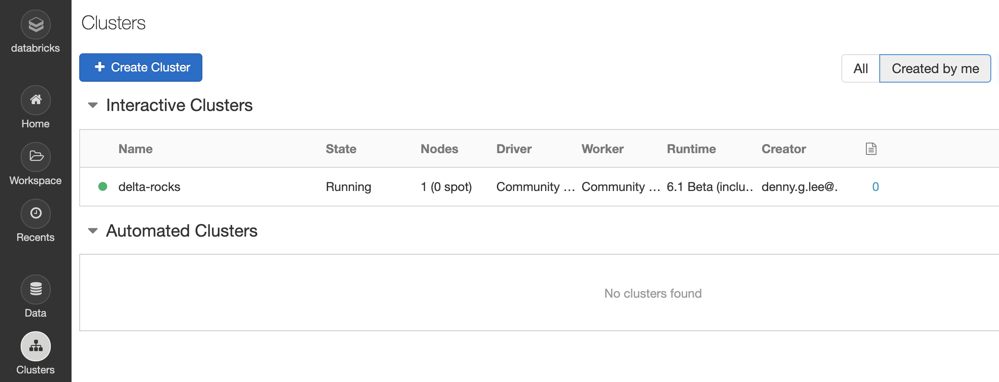 

Note, within DBCE, you can only create one cluster at a time.  If one already exists, you will need to either use it or create a new one.

### Importing Notebooks

Expand to view more details about Importing Notebooks

&nbsp; &nbsp;
For these next steps, we will import the following notebook so keep the following links handy:

* [Scala Tutorial](./SAISEu19%20-%20Delta%20Lake%20Scala%20Tutorial.scala) 
* [Python Tutorial](./SAISEu19%20-%20Delta%20Lake%20Python%20Tutorial.py)

Start by opening up one of the notebooks in the preceding links *in a new window* and **copy** the URL.

Then go back to your Databricks workspace, *right click* and then choose **Import**.

This will open up the *Import Notebooks* dialog in the Databricks workspace.  

Paste the notebook URL you had copied from two screens prior into the *Import Notebooks* dialog.

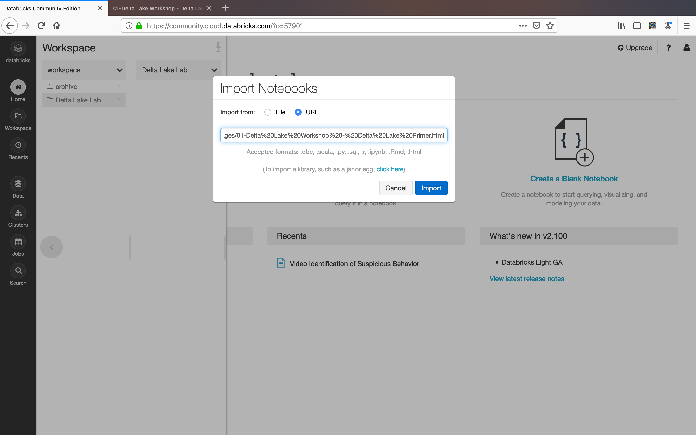

Once you have imported the notebook, your screen should similar to the view below. 

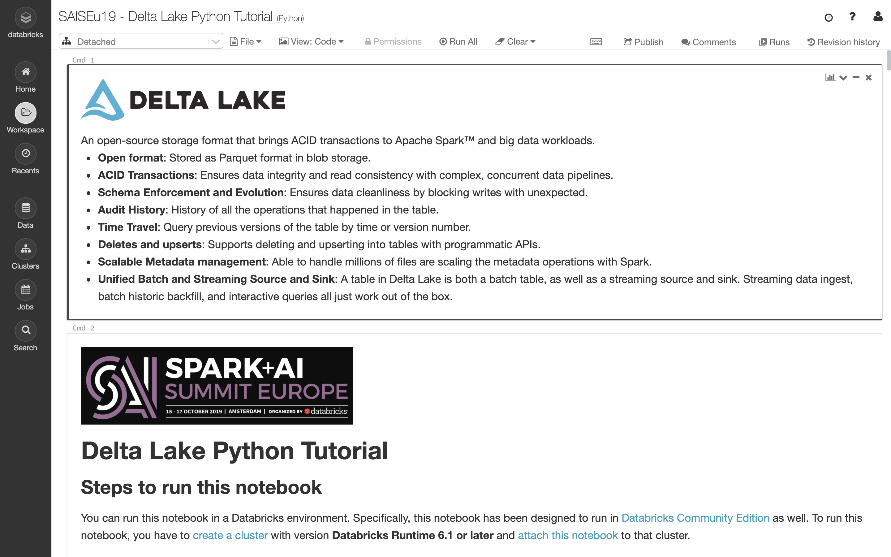

### Attaching Notebooks

Expand to view more details about Attaching Notebooks

&nbsp; &nbsp;
Near the top left, click the *cluster dropdown* and choose the cluster you want to attach the notebook.  

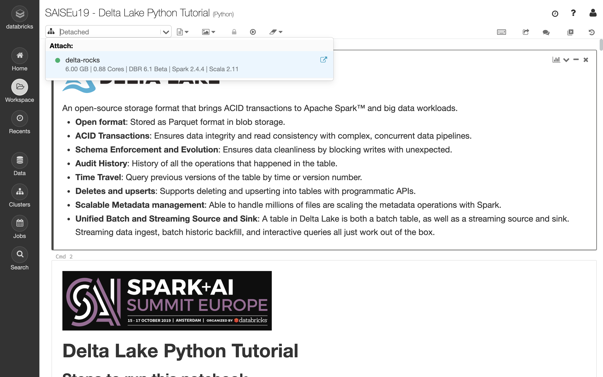

