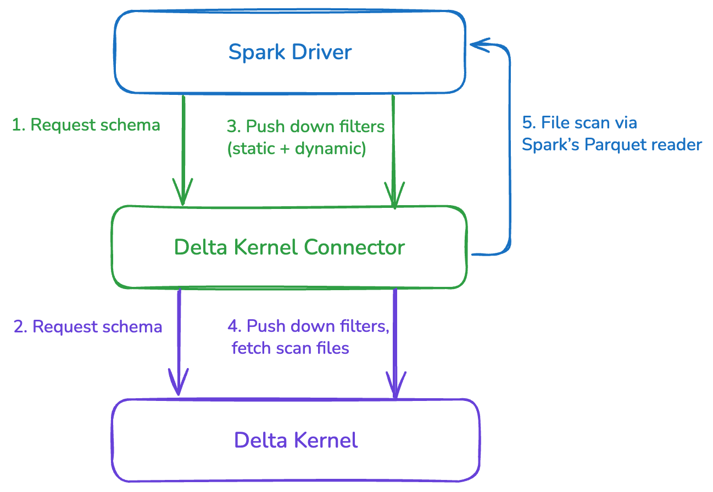

# Delta Kernel – Spark Connector

The **Delta Kernel Spark Connector** enables Apache Spark to read Delta tables using the Delta Kernel.
It leverages Spark’s DataSource V2 (DSV2) APIs to integrate Delta Kernel into Spark’s query execution pipeline.

---

## High-Level Design

The **Delta Kernel Spark Connector** sits between Spark and Delta Kernel, bridging the two:

1. **Spark Driver** requests the table schema and pushes down both static and dynamic filters through the connector.
2. **Delta Kernel Connector** translates these requests to Delta Kernel APIs:
   - Requests table schema from Delta Kernel.
   - Pushes down filters and fetches the list of files to scan.
3. **Delta Kernel** resolves table state from Catalog and Delta logs, applies file skipping, and returns the necessary files.
4. **Spark Engine** partitions the files (default 128MB splits) and executes the actual Parquet scans using Spark’s existing `ParquetFileFormat`.

  

